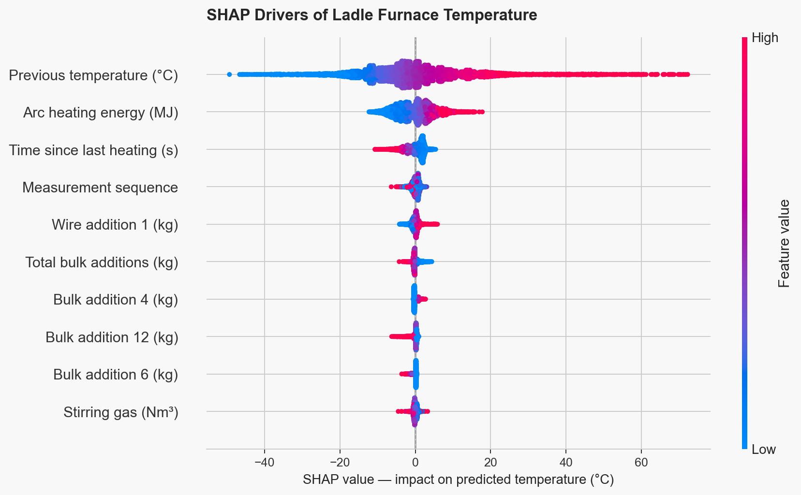

# Ladle Furnace Temperature Prediction
Predict steel temperature during ladle furnace (LF) treatment using physically motivated, causally correct features and an XGBoost regressor.

## Key Results

| Model / metric | MAE (°C) |
|---|---:|
| Baseline (prev_temp predictor, CV) | 8.46 ± 0.22 |
| Default XGBoost (CV) | 6.22 ± 0.12 |
| Tuned XGBoost (CV) | 5.71 ± 0.15 |
| Tuned XGBoost (test, operational scope) | 6.56 |

A 6.56°C MAE is operationally meaningful: it is well within half of a typical LF tapping temperature window (±10–15°C), enabling tighter control of final superheat with fewer reheats and fewer off-target taps.

## Domain Context

A Ladle Furnace (LF) is a secondary steelmaking unit where liquid steel is treated after primary refining. The process is cyclic: electric arc heating adds energy, bulk and wire additions adjust chemistry, bottom stirring gas homogenizes temperature and composition, and operators measure temperature repeatedly until the heat is ready for casting.

Temperature prediction matters because casting requires hitting a narrow tapping/superheat target. Too cold risks misruns, nozzle clogging, and sequence instability; too hot increases refractory wear, oxidation losses, and inclusion problems. It is a hard prediction problem because temperature is the result of competing mechanisms operating on different time scales: joule heating from the arc, radiative and conductive losses to the ladle and atmosphere, and enthalpy sinks from cold alloy and flux additions.

## Repository Structure

```text
.
├── notebooks/
│   ├── 01_data_exploration.ipynb        # EDA, timestamp conversion, data quality checks, anomaly investigation
│   ├── 02_feature_engineering.ipynb     # Causally correct feature matrix construction (features.csv)
│   ├── 03_modeling.ipynb                # GroupKFold training, baseline vs XGBoost, Optuna tuning, test evaluation
│   └── 04_explainability.ipynb          # SHAP analysis + linked-in ready beeswarm export
├── results/
│   ├── shap_beeswarm.png       # SHAP beeswarm — top 10 features by impact
│   └── actual_vs_predicted.png # Predicted vs actual temperature on test set
├── src/
│   └── features.py                      # Feature functions used by Notebook 02
├── data/
│   ├── raw/                             # Kaggle CSVs (gitignored)
│   └── processed/                       # Generated features and predictions (created by notebooks)
├── requirements.txt                     # Python dependencies
└── .gitignore
```

## How to Run

1. Clone the repository:
   ```bash
   git clone https://github.com/pv-toledo/ladle-furnace-ml.git
   cd ladle-furnace-ml
   ```

2. Create and activate a virtual environment:
   ```bash
   python -m venv .venv
   source .venv/bin/activate   # macOS/Linux
   # .venv\Scripts\activate    # Windows PowerShell
   ```

3. Install dependencies:
   ```bash
   pip install -r requirements.txt
   ```

4. Download the dataset from Kaggle and place the CSV files in `data/raw/`:
   ```text
   https://www.kaggle.com/datasets/yuriykatser/industrial-data-from-the-ladlefurnace-unit
   ```
   `data/raw/` is gitignored because it contains the external dataset.

5. Run notebooks in order:
   - `01_data_exploration.ipynb`
   - `02_feature_engineering.ipynb`
   - `03_modeling.ipynb`
   - `04_explainability.ipynb`

## Dataset

The dataset is composed of eight CSV files keyed by `key` (heat/melt identifier). Timestamps are stored as strings and converted to `datetime` in the notebooks.

- `data_arc.csv` — arc heating sessions per heat; includes `Heating start`, `Heating end`, and `Active power` (energy input proxy).
- `data_bulk.csv` — per-heat bulk addition masses (`Bulk 1` … `Bulk 15`) in kg.
- `data_bulk_time.csv` — timestamps for each bulk addition (`Bulk 1` … `Bulk 15`) per heat.
- `data_wire.csv` — per-heat wire addition masses (`Wire 1` … `Wire 9`) in kg.
- `data_wire_time.csv` — timestamps for each wire addition (`Wire 1` … `Wire 9`) per heat.
- `data_gas.csv` — bottom stirring gas usage per heat.
- `data_temp.csv` — temperature measurements; `Temperature` is NaN for test rows (masked targets).
- `data_temp_FULL_with_test.csv` — same structure as `data_temp.csv`, but with all temperatures filled; used only for ground-truth evaluation via `true_temp`.

## Feature Engineering

Core design principle: strict temporal causality. Every feature at a measurement timestamp is computed only from events that occurred at or before that timestamp, matching the real LF decision problem.

Main feature families:

- Cumulative arc energy (`cumulative_energy_MJ`) — joules delivered to the melt (active power × heating duration accumulated up to the measurement).
- Time since last heating (`time_since_heating_s`) — proxy for radiative and conductive heat loss since the last arc input.
- Cumulative bulk additions per material (`Bulk_1_cum` … `Bulk_15_cum`, `total_bulk_cum`) — thermal sinks from cold solids dissolving into liquid steel.
- Cumulative wire additions per material (`Wire_1_cum` … `Wire_9_cum`, `total_wire_cum`) — smaller thermal sinks, also tied to refining practice.
- Gas total (`gas_total`) — bottom stirring that homogenizes temperature and affects refining kinetics.
- Previous temperature (`prev_temp`) — strongest thermal anchor; encodes the last measured bath state.
- Measurement sequence index (`measurement_index`) — process stage proxy (early vs late treatment).

First measurements (arrival temperatures) are excluded from modeling scope. Arrival temperature depends on upstream variables not present in the dataset (tapping temperature, ladle transit time, refractory thermal history), and mixing this with incremental LF prediction degrades both performance and interpretability. Removing first measurements removes 3,216 rows (one per heat), leaving 12,683 rows (9,784 train, 2,899 test).

## Results



SHAP confirms the model learned physically meaningful LF behavior. `prev_temp` dominates the prediction (mean |SHAP| = 9.95°C, 47.5% of total attribution) because LF temperature evolution is incremental around the current bath state. `cumulative_energy_MJ` pushes predictions upward (mean |SHAP| = 3.80°C) because arc energy is the primary heat input. `time_since_heating_s` pulls predictions downward (mean |SHAP| = 1.86°C) as a proxy for radiative and conductive losses to ladle and atmosphere. Bulk additions contribute negative corrections through `total_bulk_cum` and individual bulk channels because cold solids absorb enthalpy as they heat and dissolve.

## Limitations

Arrival temperature prediction is out of scope. The first measurement is always physically measured and is dominated by upstream conditions not present in the dataset, so the model is scoped to intermediate and final measurements where a prior temperature anchor exists.

2,161 test rows are excluded from evaluation because `prev_temp` is NaN. This is a competition artifact: consecutive masked temperatures in `data_temp.csv` propagate NaN through the `prev_temp` chain. In real LF operation, the operator always has the previous measured temperature before requesting a prediction. Final test MAE (6.56°C) is reported on the 738 operationally valid test rows where `prev_temp` exists.

Bulk and wire material identities are anonymized (`Bulk 1` … `Bulk 15`, `Wire 1` … `Wire 9`). Material-specific SHAP effects are physically interpretable as distinct enthalpy and practice signatures, but cannot be confirmed without decoding the material mapping.

## License and acknowledgements

MIT License.

Dataset: Kaggle — Industrial data from the ladle-furnace unit (credit to the dataset author on Kaggle).
https://www.kaggle.com/datasets/yuriykatser/industrial-data-from-the-ladlefurnace-unit